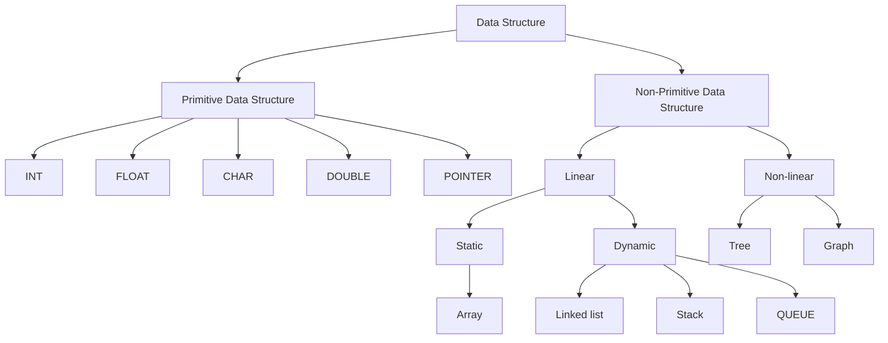

# Data Structure

## Definition

Data Structure is the way of storing and organizing data efficiently so that it can be accessed and modified easily.

---

## Classification of Data Structures

```text



---

## 1. Primitive Data Structure

Primitive data structures are basic data types provided by a programming language.

- **INT** → Stores integer values.
- **FLOAT** → Stores decimal values.
- **CHAR** → Stores a single character.
- **DOUBLE** → Stores large decimal values with higher precision.
- **POINTER** → Stores the memory address of another variable.

---

## 2. Non-Primitive Data Structure

Non-primitive data structures are derived from primitive data types and are used to store collections of data.

### A. Linear Data Structure

In a linear data structure, elements are arranged sequentially.

#### Static Data Structure

- **Array**: Collection of elements stored in contiguous memory locations.
- Size is fixed during declaration.

#### Dynamic Data Structure

- **Linked List**: Collection of nodes connected through pointers.
- Size can grow or shrink dynamically.

##### Stack

- Follows **LIFO (Last In, First Out)** principle.
- Example: Stack of plates.

##### Queue

- Follows **FIFO (First In, First Out)** principle.
- Example: Queue at a ticket counter.

---

### B. Non-Linear Data Structure

In a non-linear data structure, elements are not arranged sequentially.

#### Tree

- Hierarchical structure consisting of nodes and edges.
- Used in file systems and databases.

#### Graph

- Collection of vertices (nodes) and edges.
- Used in social networks, maps, and network routing.

---

