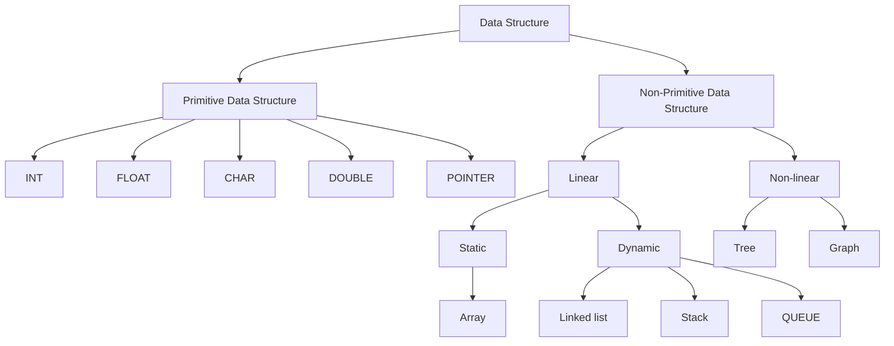

# Data Structure

→ Data structure is the way of storing and organising Data.

```mermaid
flowchart TD
    A[Data Structure] --> B[Primitive Data Structure]
    A --> C[Non-Primitive Data Structure]
    B --> D[INT]
    B --> E[FLOAT]
    B --> F[CHAR]
    B --> G[DOUBLE]
    B --> H[POINTER]
    C --> I[Linear]
    C --> J[Non-linear]
    I --> K[Static]
    I --> L[Dynamic]
    K --> M[Array]
    L --> N[Linked list]
    L --> O[Stack]
    L --> P[QUEUE]
    J --> Q[Tree]
    J --> R[Graph]
```